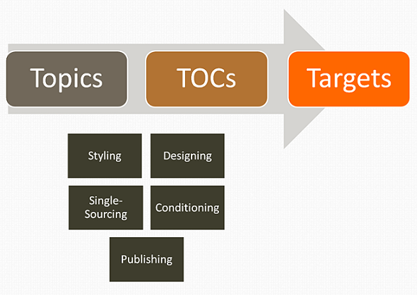

# MadCap Flare basics  

MadCap Flare is a powerful, professional help authoring tool (HAT) used by technical writers to create, manage, and publish a variety of technical documentation, such as user manuals, online help systems, and knowledge bases. It offers advanced features like content reuse, single-source publishing, and multi-format output (HTML5, PDF, and more), making it ideal for creating consistent and high-quality documentation for both online and print formats. MadCap Flare uses an XML-based architecture and integrates with many common (Git, TFS, etc) version control tools for efficient collaboration and streamlined workflows within technical writing teams.

Here's a basic workflow of how Flare works:

